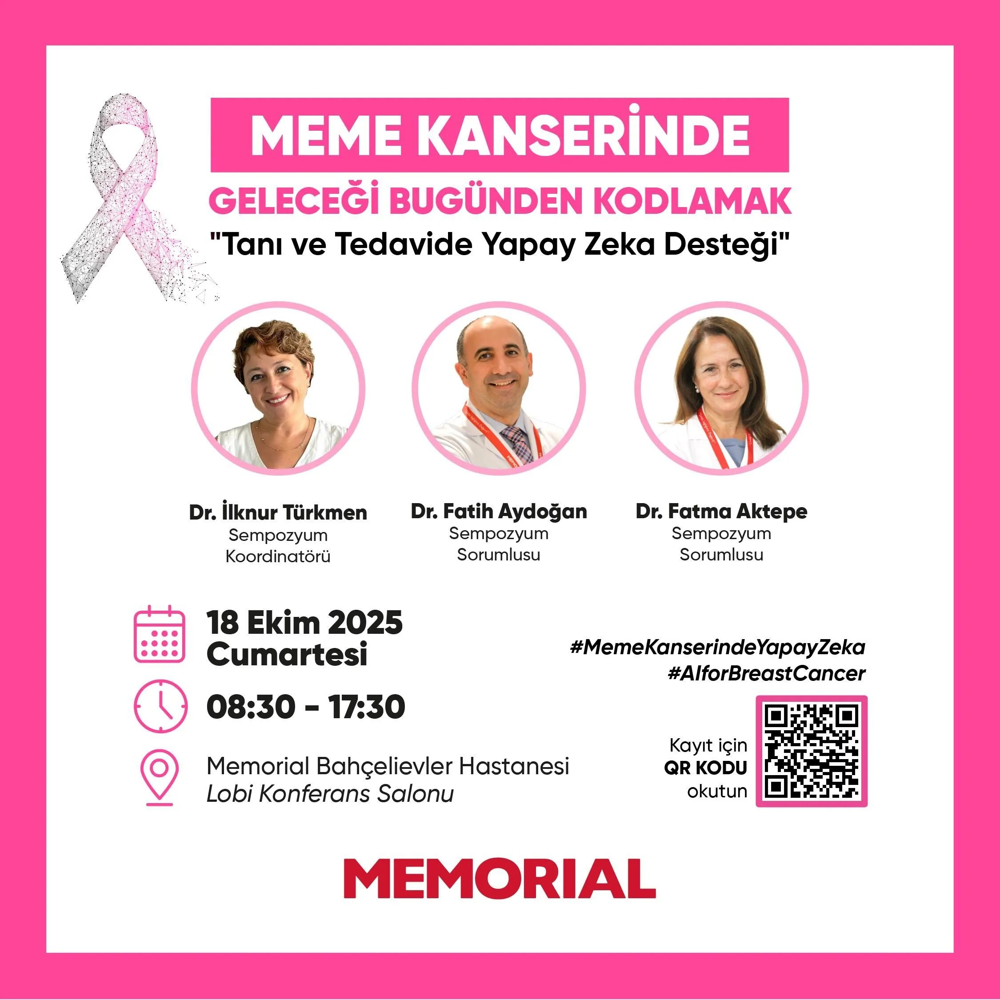

- Mühendisler ve Hekimler Ortak Bir Dili Nasıl Kurar?  
[https://www.serdarbalci.com/muhendis-hekim-ortak-dil/](https://www.serdarbalci.com/muhendis-hekim-ortak-dil/)  

- [Mühendisler ve Hekimler Ortak Bir Dili Nasıl Kurar? Patologdan Mühendislere](https://www.serdarbalci.com/muhendis-hekim-ortak-dil/)  

- [Meme Kanserinde Geleceği Bugünden Kodlamak\
Memorial Bahçelievler Hastanesi\
18 EKİM 2025 CUMARTESİ 08:30 - 17:30](https://www.memorial.com.tr/etkinlikler/meme-kanseri-bilimsel-toplanti-bahcelievler)

